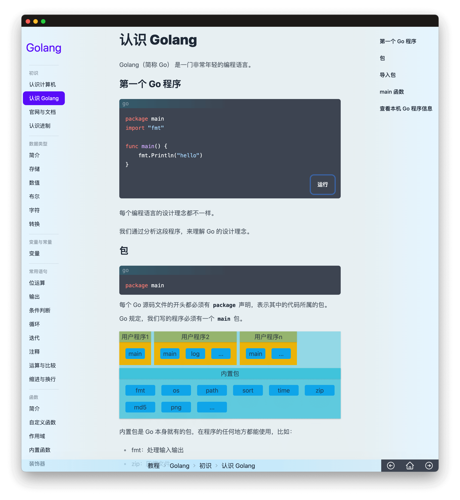

# Kuaiyizhi

一套软件工程领域的教程，也是编程实践时的知识手册。



## Features

🎯 用多彩的文字和图片吸引大脑  
💪 深入浅出，知其然知其所以然  
📦 支持直接在软件内运行样例代码  
🌱 对比式学习，一次学习多个编程语言

## 开发

- 项目初始化

```sh
npm i
npm install node-gyp@latest -g
npm run rebuild
```

> 尽量不使用 cnpm，可能会存在问题

以上操作是为了将项目依赖存储在`node_modules`文件夹。

- 运行与调试

```
npm run dev
```

- 查看样式

```
npm run tailwind
```

## Thanks To

- 🖥 [Electron.js](https://www.electronjs.org)
- 🏃 [Vue.js](https://cn.vuejs.org)
- 🌈 [TailwindCSS](https://www.electronjs.org)
- 🍞 [HeroIcons](https://heroicons.com)
- 🎹 [XTerm](https://xtermjs.org)
- 🚄 [node-pty](https://github.com/microsoft/node-pty)
